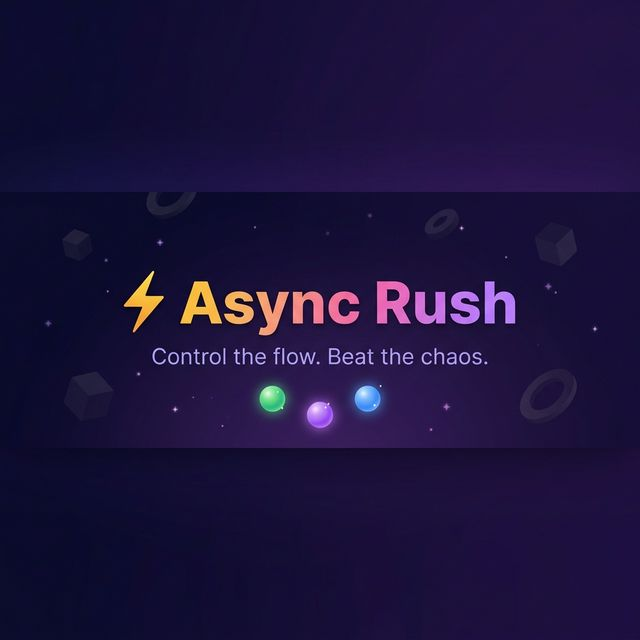

<div align="center">



<br/><br/>

<a href="https://async-rush.onrender.com">
  
</a>

<br/><br/>


<br/>


</div>

<br/>

---

<br/>

## 💡 Why This Exists

Most developers learn the event loop from diagrams and blog posts — and forget it by the interview.

**Async Rush** takes a different approach: you physically **drag tasks through the JavaScript runtime** — Call Stack, Web API, queues — and the game tells you if you got the execution order right. It's not a quiz. It's a simulation you actually play.

<br/>

---

<br/>

## 🎮 How It Works

<br/>

<div align="center">

`📖 Read the snippet` **→** `🖱️ Drag tasks to the right zones` **→** `▶️ Watch the event loop execute` **→** `⭐ Earn stars`

</div>

<br/>

> **30 levels** across three difficulty zones — covering `console.log` ordering, `Promise.then`, `async/await`, `setTimeout`, `queueMicrotask`, and deeply nested combinations.

<br/>

<div align="center">

| 🟩 Call Stack | 🌐 Web API | 🟣 Microtask Queue | 🔵 Macrotask Queue | 🔄 Event Loop |
|:---:|:---:|:---:|:---:|:---:|
| Runs sync code | Handles timers & I/O | `.then()`, `await` | `setTimeout` callbacks | Moves tasks → stack |

</div>

<br/>

---

<br/>

## ✨ What's Inside

<br/>

<table>
<tr>
<td width="50%">

#### 🧩 30 Hand-Crafted Levels
Three difficulty zones — Easy, Medium, Hard — with progressive unlocking. Each level teaches a specific async pattern.

#### 🎨 3D Engine Visualization
A full Three.js scene with a rotating call stack cylinder, pulsing event loop ring, floating particles, and glowing queue platforms.

#### 🖱️ Drag & Drop Mechanics
Built with dnd-kit. Drop task balls into engine zones with visual feedback — glow on hover, snap on correct placement.

</td>
<td width="50%">

#### 🗺️ Winding Level Map
SVG path progression with animated nodes — pulsing sonar for current level, checkmarks for completed, locks for upcoming.

#### 📊 Player Profile & Stats
Total score, stars earned, highest difficulty cleared, editable bio — all persisted server-side.

#### 🔐 Cookie-Based Auth
JWT stored in HTTP-only cookies. No tokens in localStorage. Register, login, and your progress stays with you.

</td>
</tr>
</table>

<br/>

---

<br/>

## 🏗️ Architecture

```
                    ┌──────────────────────────┐
                    │       Frontend           │
                    │  React · Vite · Three.js │
                    │  Framer Motion · dnd-kit │
                    └────────────┬─────────────┘
                                 │ /api/*
                                 ▼
                    ┌──────────────────────────┐
                    │        Backend           │
                    │  Express 5 · JWT · Zod   │
                    │  bcrypt · cookie-parser   │
                    └────────────┬─────────────┘
                                 │
                                 ▼
                    ┌──────────────────────────┐
                    │      MongoDB Atlas       │
                    │  Users · Progress · Scores│
                    └──────────────────────────┘
```

<br/>

---

<br/>

## 📂 Project Structure

```
async-rush/
├── backend/
│   └── src/
│       ├── config/          # MongoDB connection
│       ├── controllers/     # Auth · Game · User business logic
│       ├── middleware/       # JWT guard · Zod validation · Error handler
│       ├── models/           # User schema — progress[], scores, bio
│       ├── routes/           # /api/auth · /api/game · /api/users
│       ├── schemas/          # Zod request validation
│       ├── utils/            # JWT cookie helper · async handler · response fmt
│       ├── app.js            # Express app — CORS, middleware
│       └── server.js         # Entry — MongoDB connect → listen
│
├── frontend/
│   └── src/
│       ├── auth/             # AuthContext — cookie session management
│       ├── components/       # TaskBall · EngineComponent · EventLoopWidget
│       ├── game/             # 30 levels · useGameStore reducer
│       ├── lib/              # api.js — fetch wrapper (credentials: include)
│       ├── pages/            # Landing · Auth · LevelSelect · Game · Profile
│       ├── scene/            # Three.js — CallStack3D · EventLoop3D · WebAPI3D
│       ├── App.jsx           # Router + protected routes
│       └── index.css         # Design system — tokens · keyframes
│
├── assets/                   # README banner
└── .gitignore
```

<br/>

---

<br/>

## ⚙️ Getting Started

### Prerequisites

- **Node.js** ≥ 18
- **MongoDB** — local or free [Atlas cluster](https://mongodb.com/atlas)

<br/>

### 1 · Clone

```bash
git clone https://github.com/bivek127/async-rush.git
cd async-rush
```

### 2 · Backend

```bash
cd backend && npm install
```

Create `backend/.env` :

```env
NODE_ENV=development
PORT=8000
MONGO_URI=mongodb://localhost:27017/asyncrush
JWT_SECRET=replace_with_a_random_64byte_string
JWT_EXPIRES_IN=7d
CORS_ORIGIN=http://localhost:5173
```

```bash
npm run dev          # → http://localhost:8000
```

### 3 · Frontend

```bash
cd frontend && npm install
npm run dev          # → http://localhost:5173
```

### 4 · Play

Open `http://localhost:5173` → Register → Start solving ⚡

<br/>

---

<br/>

## ⚠️ Dev Notes

<details>
<summary>&nbsp;&nbsp;<strong>Vite Proxy</strong> — how frontend talks to backend in dev</summary>

<br/>

`vite.config.js` proxies `/api` → `http://localhost:8000` in dev. The frontend never calls the backend URL directly — Vite forwards everything.

**No `VITE_API_BASE_URL` needed locally.** In production, set it to your deployed backend URL.

```js
proxy: { '/api': { target: 'http://localhost:8000', changeOrigin: true } }
```

<br/>
</details>

<details>
<summary>&nbsp;&nbsp;<strong>Cookie Auth</strong> — not Bearer tokens</summary>

<br/>

Auth uses **HTTP-only cookies**. In dev, cookies work because Vite proxy unifies the origin. In production with separate domains, `sameSite: 'none'` and `secure: true` are already configured.

All fetch calls use `credentials: 'include'`.

<br/>
</details>

<details>
<summary>&nbsp;&nbsp;<strong>Troubleshooting</strong></summary>

<br/>

| Symptom | Fix |
|---------|-----|
| `ECONNREFUSED` on API calls | Backend isn't running on port 8000 |
| Login works but redirects to `/auth` | `JWT_SECRET` not set in `.env` |
| MongoDB connection fails | Check `MONGO_URI` — Atlas needs IP allowlist `0.0.0.0/0` |
| CORS error in production | Set `CORS_ORIGIN` to your exact frontend URL |

<br/>
</details>

<br/>

---

<br/>

## 🌍 Deployment

Deployed on **[Render](https://render.com)** as two services:

| Service | Type | Root Dir | Build | Start |
|---------|------|----------|-------|-------|
| Backend | Web Service | `backend` | `npm install` | `npm start` |
| Frontend | Static Site | `frontend` | `npm run build` | serves `dist/` |

<details>
<summary>&nbsp;&nbsp;<strong>Environment Variables</strong></summary>

<br/>

**Backend** — `NODE_ENV`, `PORT`, `MONGO_URI`, `JWT_SECRET`, `JWT_EXPIRES_IN`, `CORS_ORIGIN`

**Frontend** — `VITE_API_BASE_URL` (your backend URL)

<br/>
</details>

> **Note:** Render free tier sleeps after 15 min of inactivity. First request may take ~30s.

<br/>

---

<br/>

## 🛠️ Roadmap

- [ ] 🏆 Global leaderboard
- [ ] ⏱️ Timed challenge mode
- [ ] 🧪 Code playground — paste your own async snippets
- [ ] 📱 Mobile touch support
- [ ] ♿ Keyboard-only gameplay

<br/>

---

<br/>

## 🤝 Contributing

```
fork → branch → commit → push → PR
```

All contributions welcome — new levels, bug fixes, UI improvements.

<br/>

---

<br/>

<div align="center">

**Built with ⚡ by [Bivek](https://github.com/bivek127)**

*Stop memorizing the event loop. Start playing it.*

<br/>

<a href="https://async-rush.onrender.com">
  
</a>

</div>
